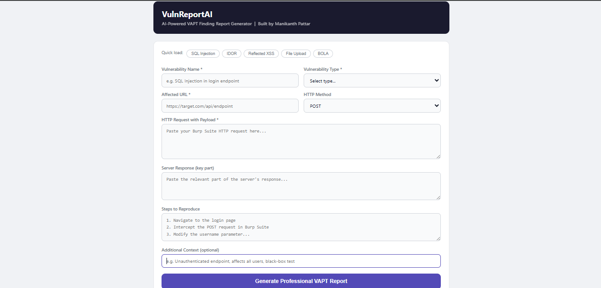
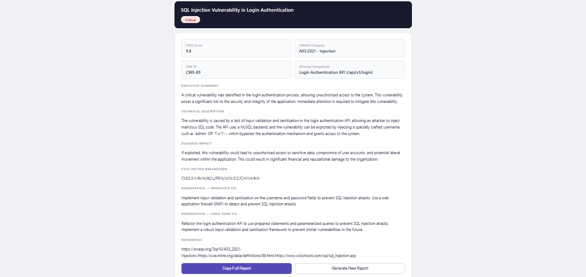

# VulnReportAI — AI-Powered VAPT Report Generator

An intelligent penetration testing tool that automatically generates
professional vulnerability assessment reports from raw finding data
using the Groq AI API (Llama 3.3-70b model).
---

## What It Does

Enter raw vulnerability details (URL, HTTP request, response, steps)
and get a complete professional VAPT finding report including:

- CVSS 3.1 score with full vector breakdown
- OWASP category mapping (Web Top 10 + API Top 10)
- CWE ID identification
- Executive summary (non-technical, for management)
- Technical root cause description
- Business impact analysis
- Proof of concept documentation
- Immediate and long-term remediation steps
- References (OWASP, CWE, CVE)

Reduces manual report writing time by approximately 70%.

---

## Supported Vulnerability Types

SQL Injection | Cross-Site Scripting (XSS) | IDOR / Broken Access Control
BOLA (API) | Unrestricted File Upload | Business Logic Flaw
CSRF | Authentication Weakness | Security Misconfiguration | SSRF

---

## Tech Stack

| Layer | Technology |
|---|---|
| Language | Python 3 |
| AI Engine | Groq API (Llama 3.3-70b) |
| Web Server | Flask |
| Frontend | HTML / CSS / JavaScript |
| Security | python-dotenv for key management |

---

## Project Structure

VulnReportAI/
├── vulnreportai.py   CLI tool — run from terminal
├── app.py            Flask web server backend
├── index.html        Web UI frontend
├── requirements.txt  Python dependencies
├── samples/          Sample vulnerability input files
├── reports/          Sample AI-generated report outputs
└── README.md         This file

---

## Setup Instructions

### 1. Clone the repository
git clone https://github.com/Mani1441/VulnReportAI.git
cd VulnReportAI

### 2. Install dependencies
pip install -r requirements.txt

### 3. Create your .env file
Create a file called .env in the project root folder and add:
GROQ_API_KEY=your-groq-api-key-here

Get a FREE Groq API key (no credit card needed) at:
https://console.groq.com/keys

### 4. Run CLI version (terminal-based)
python vulnreportai.py

### 5. Run Web UI version (browser-based)
python app.py
Then open: http://localhost:5000

---

## Sample Output

The reports/ folder contains sample reports generated for:
- SQL Injection finding
- IDOR / Broken Access Control finding
- Reflected XSS finding

---

## Screenshots

Home Page

---

## About the Developer

Built by Manikanth Pattar
Cybersecurity Engineer | VAPT Specialist | Red Team Intern

- LinkedIn: https://www.linkedin.com/in/manikanth-pattar1441/
- GitHub: https://github.com/Mani1441
- Email: manikanthpattar1441@gmail.com

Skills demonstrated in this project:
VAPT methodology | Python development | AI API integration |
Vulnerability documentation | Flask web development
